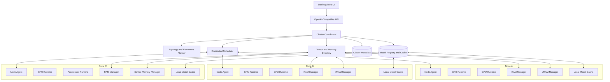
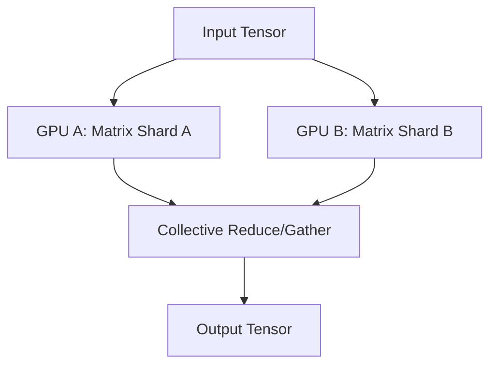
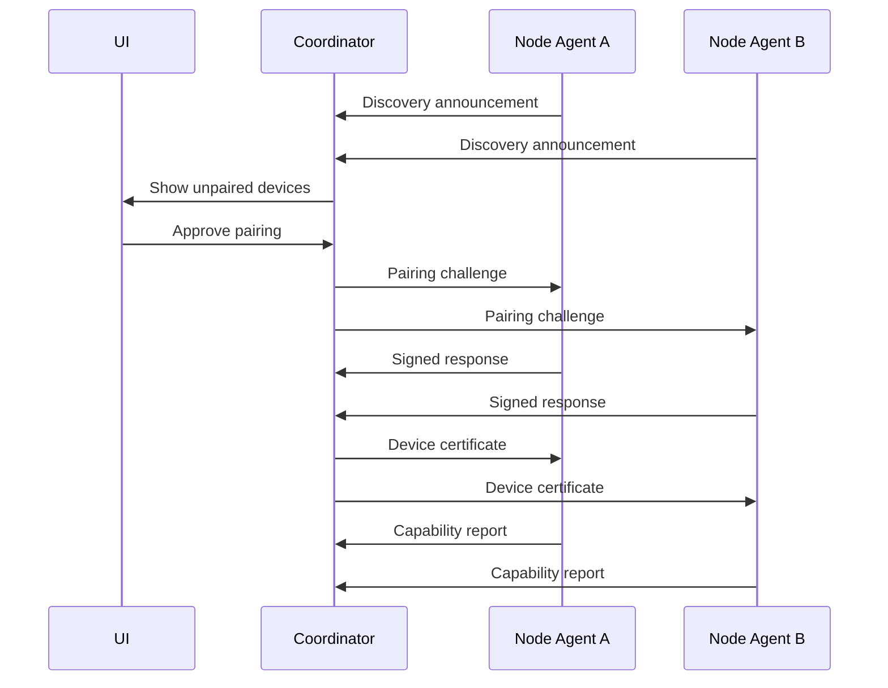
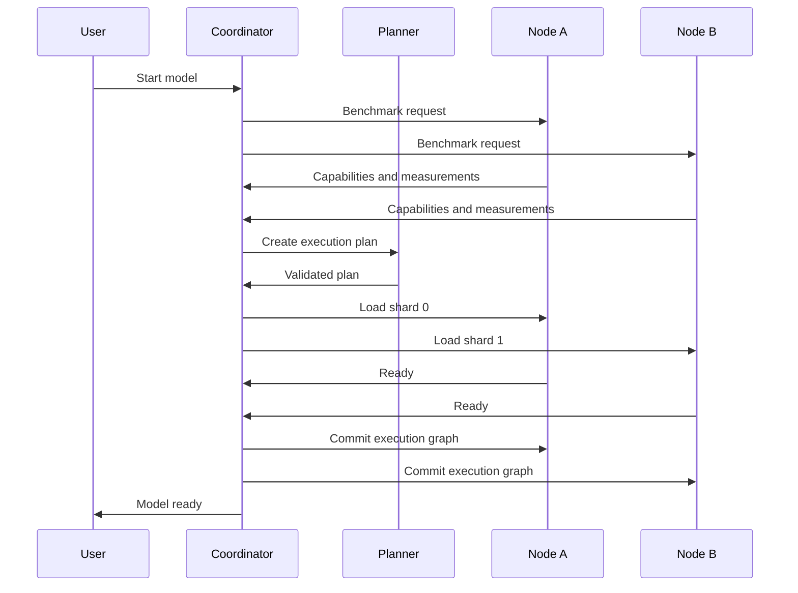
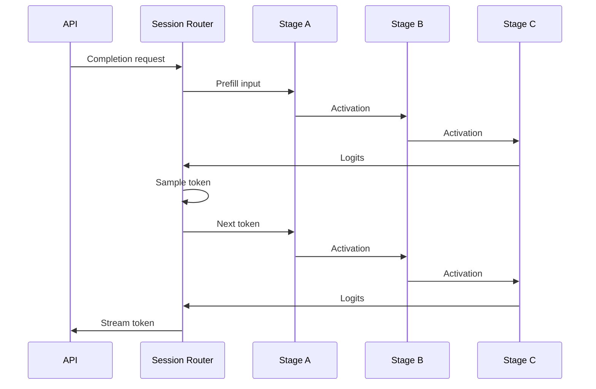

# Distributed Unified AI Compute Runtime

## Full Technical Design for Pooling CPU, RAM, GPU and VRAM Across Multiple PCs

**Document status:** Architecture proposal  
**Target:** Local-network, user-authorized, multi-PC AI inference  
**Primary goal:** Make several heterogeneous computers behave as one logical machine for running a single AI model that cannot fit, or cannot run efficiently, on one computer alone  
**Last updated:** July 2026

---

## 1. Executive Summary

This project creates a self-hosted AI runtime that combines the resources of multiple computers connected to the same local network.

The system must pool:

- CPU cores
- System RAM
- GPUs
- GPU VRAM
- Storage
- Network links
- Optional accelerators such as Apple Neural Engine, Intel NPU, AMD XDNA or similar devices

The user sees one logical AI machine:

```text
Unified AI Cluster
├── 42 CPU cores
├── 94 GB usable system RAM
├── 36 GB usable VRAM
├── 3 GPUs
├── 2.1 TB model cache storage
└── 10 Gbps effective fabric
```

However, the implementation must not pretend that remote RAM is physically identical to local RAM.

The correct abstraction is:

> A distributed tensor runtime with a unified resource and memory namespace.

Model weights, tensors, activations and KV-cache blocks are placed across the participating machines. Computation is scheduled near the memory that contains the required tensors. Data is transferred only when execution crosses a device or node boundary.

This system is designed specifically for AI workloads. It is not intended to create transparent general-purpose distributed RAM for arbitrary desktop applications.

The initial implementation should use a hybrid parallelism strategy:

- Pipeline parallelism between computers
- Tensor parallelism only between sufficiently fast and compatible devices
- CPU and RAM offloading for model weights, MoE experts and KV cache
- Topology-aware tensor placement
- Dynamic spill from VRAM to local RAM, then optionally to remote RAM
- Automatic repartitioning when a node joins, leaves or becomes overloaded
- Secure user-controlled pairing and resource permissions

The main product advantage is not merely distributed inference. Existing low-level components already prove that remote devices can expose compute resources and that models can be partitioned across devices.

The product opportunity is to provide:

- Safe local-network discovery
- One-click pairing
- Hardware benchmarking
- Automatic parallelism selection
- Heterogeneous device support
- Resource limits
- Health monitoring
- Failure recovery
- A simple local AI workspace
- An OpenAI-compatible API
- Clear performance explanations instead of misleading “combined specs”

---

## 2. Product Vision

The user installs the main application on one computer and a lightweight node agent on every other computer they want to contribute.

Example:

```text
Main Desktop
RTX 4070 12 GB
32 GB RAM
Ryzen 9
        │
        │ 10 GbE
        │
Network Switch
   ├────────────── Gaming PC
   │               RTX 3060 12 GB
   │               32 GB RAM
   │               Ryzen 7
   │
   └────────────── Laptop
                   Integrated GPU
                   32 GB RAM
                   Core Ultra CPU
```

The application reports:

```text
Cluster ready

Usable resources:
- CPU: 34 cores / 52 threads
- System RAM: 81.5 GB
- GPU VRAM: 21.8 GB
- Storage cache: 1.4 TB
- Fastest path: 8.7 Gbps
- Recommended model size: up to 70B Q4 with reduced context
```

The user chooses a model and presses **Run on cluster**.

The runtime then:

1. Benchmarks the nodes and links.
2. Calculates model memory requirements.
3. Decides where every model component will live.
4. Selects pipeline, tensor, expert and CPU-offload strategies.
5. Loads model shards in parallel.
6. Creates the distributed execution graph.
7. Starts an OpenAI-compatible API.
8. Continuously monitors thermals, memory pressure and network performance.
9. Replans safely if resources change.

---

## 3. Core Reality: What “Sharing Everything” Actually Means

### 3.1 What the system can pool

The runtime can expose all participating hardware through one logical inventory:

```text
ClusterResourcePool
├── CPUs
├── GPUs
├── HostMemory
├── DeviceMemory
├── PersistentStorage
└── NetworkFabric
```

It can allocate AI tensors across those resources and schedule operations on the appropriate device.

Examples:

- Transformer layers 0–19 stored in GPU A VRAM
- Transformer layers 20–35 stored in GPU B VRAM
- Transformer layers 36–43 stored in RAM on node C and executed by its CPU
- MoE experts distributed across several GPUs and host-memory regions
- KV-cache blocks split across local VRAM, local RAM and remote RAM
- Model file pages cached on every node that needs them

### 3.2 What the system cannot honestly provide

It cannot make remote RAM behave exactly like local DDR5 RAM.

Remote access includes:

- Network latency
- Serialization overhead
- Transport copying
- Congestion
- Packet loss or retransmission
- Node scheduling delays
- Possible CPU staging between network and GPU memory

Therefore the runtime must avoid fine-grained remote memory access.

Bad design:

```text
GPU A requests a tiny remote RAM page for every matrix operation.
```

Good design:

```text
Planner places a complete tensor, layer or KV block near the device that will use it.
Transfers happen in large asynchronous chunks.
```

### 3.3 Correct user-facing wording

Avoid:

> Your four PCs now have 128 GB of shared RAM exactly like one computer.

Use:

> Your cluster has 128 GB of addressable memory available for model weights and AI runtime data.

This distinction protects the architecture from impossible performance expectations.

---

## 4. Goals

### 4.1 Primary goals

1. Run a single AI model across several computers.
2. Use RAM, CPU, GPU and VRAM from all authorized nodes.
3. Support heterogeneous hardware.
4. Automatically select a valid execution plan.
5. Avoid requiring Kubernetes, manual host files or cluster expertise.
6. Keep all model and user data inside the local network by default.
7. Recover cleanly when a node disconnects.
8. Expose one local API endpoint.
9. Provide predictable resource controls on every machine.
10. Explain why a node is used, excluded or assigned a specific role.

### 4.2 Secondary goals

- Multiple concurrent inference sessions
- Distributed image generation
- Speech and multimodal workloads
- Background indexing and embeddings
- Remote wake-on-LAN
- Model download deduplication
- Scheduled resource availability
- Cross-platform support

### 4.3 Non-goals for the first versions

- Transparent distributed memory for arbitrary applications
- Distributed model training
- Internet-wide volunteer compute
- Sharing machines without explicit authorization
- Supporting every accelerator backend from day one
- Perfect continuation of an in-progress token stream after node failure
- Treating slow Wi-Fi as equivalent to PCIe or NVLink

---

## 5. System Architecture



The system has two major planes.

### 5.1 Control plane

Responsible for:

- Discovery
- Pairing
- Authentication
- Resource inventory
- Health checks
- Topology measurement
- Model planning
- Job scheduling
- Failure detection
- Cluster state
- Permissions
- User interface

The control plane must remain lightweight. It must not carry large tensors.

### 5.2 Data plane

Responsible for:

- Weight distribution
- Tensor transfers
- Activation transfers
- KV-cache movement
- Collective GPU communication
- CPU-to-GPU staging
- Remote memory block transfer
- Distributed execution synchronization

The data plane must support several transports:

1. TCP as universal fallback
2. QUIC as an optional resilient transport
3. RDMA when supported
4. Shared memory for processes on the same node
5. GPU peer-to-peer for GPUs inside the same machine
6. NCCL for compatible NVIDIA GPU groups
7. RCCL for compatible AMD GPU groups
8. MLX distributed transport for supported Apple Silicon groups

---

## 6. Main Components

## 6.1 Cluster Coordinator

The coordinator owns the authoritative cluster state.

Responsibilities:

- Register and authenticate nodes
- Maintain node leases
- Store hardware capabilities
- Coordinate model loading
- Create execution plans
- Allocate sessions
- Track tensor ownership
- Detect node failure
- Trigger replanning
- Expose API and UI
- Record benchmark history

The coordinator should not perform all inference work. It may be configured as a compute node, but control-plane responsibilities must be isolated from compute pressure.

Recommended implementation:

- Rust coordinator service
- SQLite for single-user local deployment
- Optional PostgreSQL for team deployment
- gRPC for control communication
- Prometheus-compatible metrics endpoint
- Event log for cluster decisions

## 6.2 Node Agent

One node agent runs on every participating computer.

Responsibilities:

- User authorization
- Hardware detection
- Device enumeration
- Memory reporting
- Network testing
- Local process supervision
- Tensor allocation
- Model shard caching
- Runtime backend management
- Thermal and power monitoring
- Sandboxing
- Resource enforcement
- Secure software updates

Recommended implementation:

```text
Language: Rust
Service mode:
- Windows Service
- systemd service
- macOS launch daemon

Privileges:
- Run without administrator/root where possible
- Use elevated helper only for installation, firewall and optional device access
```

## 6.3 Runtime Adapter Layer

The product must not bind itself permanently to one inference engine.

```text
RuntimeAdapter
├── llama.cpp / GGML adapter
├── CUDA/PyTorch adapter
├── vLLM adapter
├── MLX adapter
├── ROCm adapter
├── Vulkan adapter
└── Direct custom runtime adapter
```

Common interface:

```rust
trait RuntimeAdapter {
    fn probe(&self) -> RuntimeCapabilities;
    fn load_shard(&self, spec: ModelShardSpec) -> Result<ShardHandle>;
    fn allocate_tensor(&self, spec: TensorSpec) -> Result<TensorHandle>;
    fn execute_stage(&self, request: StageExecution) -> Result<StageOutput>;
    fn transfer_tensor(&self, request: TensorTransfer) -> Result<TransferReceipt>;
    fn unload(&self, handle: ShardHandle) -> Result<()>;
    fn metrics(&self) -> RuntimeMetrics;
}
```

## 6.4 Topology Profiler

The topology profiler measures real performance rather than trusting advertised hardware specifications.

Per node:

- CPU matrix throughput
- CPU memory bandwidth
- GPU matrix throughput
- GPU memory bandwidth
- Host-to-device throughput
- Device-to-host throughput
- GPU peer-to-peer capability
- Storage read throughput
- Available pinned memory
- Thermal stability
- Power state

Per connection:

- Round-trip latency
- Sustained bandwidth
- Small-message latency
- Large-transfer bandwidth
- Packet loss
- Jitter
- RDMA availability
- Full-duplex behavior
- Congestion under simultaneous transfers

Example topology graph:

```json
{
  "nodes": {
    "node-a": {
      "cpu_score": 181.4,
      "ram_usable_bytes": 25769803776,
      "devices": ["cuda:0"]
    },
    "node-b": {
      "cpu_score": 126.8,
      "ram_usable_bytes": 21474836480,
      "devices": ["cuda:0"]
    }
  },
  "links": [
    {
      "from": "node-a",
      "to": "node-b",
      "transport": "tcp",
      "latency_us": 210,
      "bandwidth_mbps": 8740,
      "jitter_us": 24
    }
  ]
}
```

---

## 7. Unified Resource Model

The scheduler must represent physical and logical resources separately.

## 7.1 Physical resources

```text
PhysicalNode
├── CPU sockets
├── NUMA domains
├── System RAM
├── GPU devices
├── GPU VRAM
├── Storage
├── NICs
└── Power and thermal limits
```

## 7.2 Logical resources

```text
LogicalCluster
├── ComputeUnits
├── HostMemoryPool
├── DeviceMemoryPool
├── TensorStoragePool
├── KVCachePool
├── TransferChannels
└── ModelExecutionSlots
```

A logical resource is schedulable capacity, not necessarily a contiguous physical object.

Example:

```json
{
  "cluster_id": "home-cluster",
  "logical_resources": {
    "cpu_compute_units": 31.5,
    "host_memory_bytes": 87509983232,
    "device_memory_bytes": 23555211264,
    "storage_bytes": 1460288880640,
    "preferred_parallelism": "pipeline-hybrid"
  }
}
```

The reported capacity must subtract:

- Operating-system reserve
- User-configured limits
- Runtime overhead
- Safety margin
- Fragmentation allowance
- Memory already committed to sessions

---

## 8. Unified Tensor Memory

## 8.1 Virtual tensor address space

The runtime should expose a logical tensor namespace:

```text
cluster://model/{model_id}/tensor/{tensor_id}
cluster://session/{session_id}/kv/{layer}/{block}
cluster://session/{session_id}/activation/{stage}/{microbatch}
```

Every object maps to one or more physical placements.

Example:

```json
{
  "tensor_id": "model.layers.18.mlp.down_proj.weight",
  "shape": [14336, 4096],
  "dtype": "q4_k_m",
  "placements": [
    {
      "node_id": "node-b",
      "device": "cuda:0",
      "offset": 4831838208,
      "length": 308281344,
      "role": "primary"
    },
    {
      "node_id": "node-b",
      "device": "host",
      "path": "memory://pinned/11",
      "role": "warm-copy"
    }
  ]
}
```

## 8.2 Memory tiers

The planner should treat memory as tiers.

```text
Tier 0: On-device VRAM
Tier 1: Local pinned system RAM
Tier 2: Local pageable system RAM
Tier 3: Remote VRAM
Tier 4: Remote pinned RAM
Tier 5: Remote pageable RAM
Tier 6: Local NVMe
Tier 7: Remote NVMe
```

The tier order is not universal.

For example, remote VRAM over 1 GbE may be slower than local CPU execution using local RAM. Therefore every placement decision must use measured costs.

## 8.3 Tensor directory

The tensor directory tracks:

- Tensor identity
- Shape
- Data type
- Quantization format
- Physical location
- Replicas
- Version
- Mutability
- Eviction priority
- Checksum
- Ownership lease
- Transfer state

Most model weights are immutable. This makes caching and replication simpler.

Mutable objects include:

- KV cache
- Temporary activations
- Sampling state
- Speculative decoding state
- Session metadata

## 8.4 Remote RAM

Remote RAM should be used for coarse-grained objects:

- Complete model layers
- Complete tensors
- KV-cache blocks
- MoE experts
- Prefetched model pages
- Activation checkpoints

Do not implement arbitrary byte-level remote reads in the first versions.

Recommended remote memory protocol:

```protobuf
service RemoteMemory {
  rpc Allocate(AllocateRequest) returns (AllocationHandle);
  rpc Write(stream MemoryChunk) returns (WriteReceipt);
  rpc Read(ReadRequest) returns (stream MemoryChunk);
  rpc Copy(CopyRequest) returns (CopyReceipt);
  rpc Pin(PinRequest) returns (PinReceipt);
  rpc Release(ReleaseRequest) returns (ReleaseReceipt);
}
```

Every allocation must include:

- Size
- Alignment
- Data type
- Lifetime class
- Owner session
- Eviction policy
- Required checksum mode
- Security context

## 8.5 VRAM pooling

VRAM is pooled through tensor placement, not by exposing a fake monolithic GPU.

Example:

```text
GPU A VRAM:
- Embedding
- Layers 0–17
- KV cache for layers 0–17

GPU B VRAM:
- Layers 18–31
- KV cache for layers 18–31

GPU C VRAM:
- Layers 32–47
- Output norm
- LM head
- KV cache for layers 32–47
```

For tensor parallelism:

```text
Layer 12 attention projection:
- Columns 0–4095 on GPU A
- Columns 4096–8191 on GPU B
```

Tensor parallelism requires collective communication during execution and should be enabled only when the interconnect is fast enough.

---

## 9. CPU Sharing

CPU resources must be first-class compute devices.

Possible CPU workloads:

- Quantized matrix multiplication
- Model layers that do not fit in VRAM
- Mixture-of-Experts expert execution
- Tokenization
- Sampling
- Logit processing
- Tensor decompression
- Data format conversion
- Image preprocessing
- Model shard verification
- KV-cache compression
- Network data-plane work
- Speculative draft model
- Reranking
- Embeddings

The runtime should divide CPU capacity into explicit classes:

```text
reserved_system_threads
interactive_user_threads
ai_compute_threads
network_threads
background_threads
```

Node permission example:

```json
{
  "cpu": {
    "max_percent": 65,
    "max_threads": 12,
    "priority": "below-normal",
    "pause_on_user_activity": true
  }
}
```

CPU execution should be NUMA-aware on multi-socket systems.

Model tensors used by CPU stages must preferably reside in memory local to the relevant NUMA node.

---

## 10. GPU Sharing

## 10.1 Supported GPU roles

Each GPU may be assigned one or more roles:

- Pipeline stage
- Tensor-parallel rank
- MoE expert group
- Draft model
- Vision encoder
- Decoder stage
- KV-cache owner
- Transfer relay
- Standby replica

## 10.2 Compatibility groups

The planner should create GPU compatibility groups.

Example:

```text
Group A:
- NVIDIA RTX 4070
- NVIDIA RTX 3060
- Backend: CUDA
- Collectives: NCCL
- Precision: FP16, BF16 with capability checks
- Recommended: pipeline parallel
- Conditional: tensor parallel

Group B:
- Apple M-series GPU
- Backend: MLX
- Unified memory
- Recommended: independent pipeline group

Group C:
- Integrated Intel GPU
- Backend: Vulkan/SYCL
- Recommended: preprocessing or small stage
```

Cross-vendor tensor parallelism should not be a first-release requirement.

A model may still span different vendor groups through pipeline boundaries.

## 10.3 GPU execution isolation

The node agent must enforce:

- Maximum VRAM
- Maximum GPU utilization where supported
- Process-level ownership
- Cancellation
- Watchdog timeouts
- Thermal thresholds
- User activity policies

Example:

```text
Gaming mode:
- Pause AI when a full-screen game starts
- Release 80% of VRAM
- Preserve only model cache in RAM or disk
```

---

## 11. Distributed Parallelism Strategy

No single parallelism method works for every home or office cluster.

The planner must support hybrid execution.

## 11.1 Pipeline parallelism

Split the model into sequential stages.


Advantages:

- Lower communication frequency than tensor parallelism
- Works across heterogeneous devices
- Natural fit for bandwidth-limited networks
- Can place complete layers in local memory
- Easier failure isolation

Disadvantages:

- A single-token decode is sequential across stages
- Slowest stage limits throughput
- Pipeline bubbles
- Activation transfer after each stage
- Uneven layer performance can create imbalance

This should be the default cross-PC strategy.

## 11.2 Tensor parallelism

Split individual tensor operations across devices.



Advantages:

- Allows a single large layer to use combined VRAM
- Good scaling on fast, low-latency links
- Useful for similar GPUs

Disadvantages:

- Frequent synchronization
- Sensitive to latency
- Sensitive to the slowest rank
- Can hang or fail if collective calls diverge
- Poor fit for ordinary Wi-Fi
- Harder across incompatible GPU vendors

Recommended policy:

```text
Same machine, compatible GPUs:
- Tensor parallel allowed

Different machines over RDMA, Thunderbolt or high-quality 25/40/100 GbE:
- Tensor parallel considered

Different machines over stable 10 GbE:
- Benchmark before enabling

1/2.5 GbE or Wi-Fi:
- Usually reject tensor parallel
```

## 11.3 Expert parallelism

For Mixture-of-Experts models, different experts may live on different nodes.

```text
Router output:
- Tokens for experts 0–7 → Node A
- Tokens for experts 8–15 → Node B
- Tokens for experts 16–23 → Node C
```

This can use distributed memory efficiently but introduces all-to-all traffic and routing imbalance.

The planner must consider:

- Expert popularity
- Token distribution
- Link bandwidth
- Per-expert memory size
- Replication of frequently selected experts
- Overflow handling

## 11.4 CPU/GPU hybrid offload

Example:

```text
Node A GPU:
- Attention layers

Node A RAM + CPU:
- Some MoE experts

Node B GPU:
- Remaining dense layers

Node C RAM + CPU:
- Cold experts and overflow
```

The planner may keep frequently used tensors in VRAM and colder tensors in RAM.

## 11.5 Context parallelism

Long-context workloads may split sequence-related state across devices.

This is advanced and should not be part of the initial MVP.

## 11.6 Data parallelism

Data parallelism replicates the model and handles separate requests.

It does not help one model fit across pooled memory, so it is not the primary architecture discussed here.

It may be added later for throughput once the model can fit in two or more separate execution groups.

---

## 12. Automatic Planning

The planner receives:

```text
Inputs:
- Model graph
- Tensor sizes
- Quantization
- Context length
- Batch size
- Required modalities
- Node capabilities
- Memory capacity
- Link topology
- User resource limits
- Reliability history
- Power policy
```

It produces:

```text
Outputs:
- Tensor placement plan
- Pipeline stages
- Tensor-parallel groups
- Expert placement
- KV-cache placement
- Transfer schedule
- Prefetch schedule
- Memory reserve
- Expected throughput
- Expected latency
- Recovery plan
```

## 12.1 Cost model

Simplified stage cost:

```text
stage_time =
    compute_time
  + input_transfer_time
  + output_transfer_time
  + collective_time
  + memory_stall_time
  + synchronization_overhead
```

Transfer estimate:

```text
transfer_time =
    link_latency
  + payload_bytes / effective_bandwidth
  + serialization_overhead
  + staging_overhead
```

End-to-end decode estimate:

```text
token_latency ≈ sum(pipeline_stage_latency) + coordination_overhead
```

Steady-state batched throughput may improve through micro-batching, but interactive single-user decode remains latency-sensitive.

## 12.2 Placement constraints

Examples:

```text
- Tensor must fit in target device memory.
- Required backend must support tensor data type.
- Two tensor-parallel ranks must use compatible kernels.
- Every stage must reserve enough KV-cache capacity.
- Coordinator must keep a minimum control-plane memory reserve.
- Laptop battery policy may prohibit sustained GPU use.
- User-selected private nodes may not store persistent model shards.
```

## 12.3 Planner output example

```json
{
  "model": "example-70b-q4",
  "strategy": "pipeline_cpu_gpu_hybrid",
  "estimated": {
    "load_seconds": 48,
    "prompt_tokens_per_second": 31.2,
    "decode_tokens_per_second": 5.8
  },
  "stages": [
    {
      "id": 0,
      "node": "desktop-a",
      "device": "cuda:0",
      "layers": [0, 17],
      "weight_bytes": 11274289152
    },
    {
      "id": 1,
      "node": "desktop-b",
      "device": "cuda:0",
      "layers": [18, 34],
      "weight_bytes": 10908811264
    },
    {
      "id": 2,
      "node": "laptop-c",
      "device": "cpu",
      "layers": [35, 47],
      "weight_bytes": 8865724416
    }
  ],
  "kv_cache": {
    "policy": "stage_local_with_host_spill",
    "reserved_bytes": 12884901888
  }
}
```

## 12.4 Plan validation

Before loading the model, the system must simulate:

- Peak memory
- Transfer volume
- Stage imbalance
- KV-cache growth
- Concurrent request pressure
- One-node loss
- User activity changes
- Thermal throttling

A plan is rejected when it is technically loadable but operationally unusable.

Example:

```text
Plan rejected:
The model fits in combined memory, but estimated generation speed is
0.42 tokens/second because Node C is connected through 180 Mbps Wi-Fi.
```

---

## 13. Model Memory Planning

## 13.1 Weight memory

Approximate unquantized weight storage:

```text
weight_bytes ≈ parameter_count × bytes_per_parameter
```

Common theoretical values:

```text
FP32: 4 bytes per parameter
FP16/BF16: 2 bytes per parameter
INT8: approximately 1 byte per parameter plus metadata
4-bit: approximately 0.5 bytes per parameter plus quantization metadata
```

Actual files and runtime allocations vary by quantization format, alignment and backend.

## 13.2 KV-cache memory

KV-cache usage depends on:

- Number of layers
- Context length
- Batch size
- KV heads
- Head dimension
- Cache data type
- Model architecture

The planner must read architecture metadata instead of estimating only from parameter count.

## 13.3 Runtime overhead

Reserve memory for:

- CUDA/ROCm/Metal contexts
- Kernel workspace
- Graph capture
- Temporary tensors
- Communication buffers
- Pinned staging buffers
- Fragmentation
- Tokenizer and model metadata
- Node agent and operating system

Recommended safety reserve:

```text
VRAM:
- Minimum fixed backend reserve
- Plus 5–15% fragmentation and temporary-workspace margin

RAM:
- Operating-system reserve
- User-configured reserve
- Runtime reserve
- Emergency pressure margin
```

Never advertise raw physical memory as fully usable cluster memory.

---

## 14. KV-Cache Architecture

KV cache becomes a major memory consumer for long-context inference.

## 14.1 Stage-local ownership

Default policy:

```text
Each pipeline stage owns the KV cache for its own transformer layers.
```

Benefits:

- Computation remains near cache
- No remote lookup during every layer
- Simple lifecycle management

## 14.2 KV-cache tiers

```text
Hot blocks:
- Local VRAM

Warm blocks:
- Local pinned RAM

Cold blocks:
- Local RAM or remote RAM

Archived session blocks:
- NVMe, only when pause/resume latency is acceptable
```

## 14.3 Block format

```json
{
  "session_id": "session-123",
  "layer_range": [18, 34],
  "token_range": [4096, 4351],
  "dtype": "fp8",
  "bytes": 268435456,
  "owner": "desktop-b",
  "tier": "vram",
  "checksum": "blake3:..."
}
```

## 14.4 Migration

KV-cache migration may occur when:

- Node is overheating
- User reclaims resources
- Session is paused
- Model is rebalanced
- A node is preparing to disconnect

Migration must use copy-on-transition:

1. Allocate destination block.
2. Transfer block.
3. Verify checksum.
4. Atomically update directory ownership.
5. Release source block.

Do not move hot KV-cache blocks during active decoding unless necessary.

---

## 15. Data Transfer and Networking

## 15.1 Transport selection

```text
Same process:
- Direct pointer

Same machine:
- Shared memory
- CUDA IPC
- GPU peer-to-peer
- Local NCCL/RCCL

Different machines:
- RDMA if available
- Otherwise optimized TCP
- Optional QUIC for unstable links
```

## 15.2 Connection classes

Suggested default behavior:

| Effective Link | Default Use |
|---|---|
| Under 300 Mbps | Model cache, background tasks, cold storage |
| 300 Mbps–1 Gbps | Coarse pipeline stages, remote weight storage with aggressive prefetch |
| 1–2.5 Gbps | Pipeline parallelism with limited crossings |
| 2.5–10 Gbps | Strong pipeline parallelism, conditional tensor parallelism |
| 10–25 Gbps | Pipeline and selective tensor/expert parallelism |
| 25+ Gbps or RDMA | Full distributed strategies subject to benchmark |
| Thunderbolt/RDMA-class link | Low-latency local device cluster |

These are planner starting points, not guarantees.

Measured performance is authoritative.

## 15.3 Transfer optimizations

- Large contiguous chunks
- Asynchronous prefetch
- Double buffering
- Pinned host memory
- Zero-copy where the backend supports it
- Compression for compressible activation formats
- Quantized activation transfer where accuracy permits
- Transfer-compute overlap
- Link-aware routing
- Tensor caching
- Immutable weight deduplication
- Checksums only at suitable granularity
- Backpressure

## 15.4 Avoiding coordinator bottlenecks

Data should flow directly between compute nodes.

Bad:

```text
Node A → Coordinator → Node B
```

Good:

```text
Node A → Node B
Coordinator only authorizes and tracks the transfer.
```

## 15.5 Collective operations

Tensor-parallel groups require synchronized collective operations such as:

- AllReduce
- AllGather
- ReduceScatter
- Broadcast
- Point-to-point send/receive

Every rank must execute compatible collective operations in the same logical order.

The runtime must include:

- Collective sequence numbers
- Timeouts
- Rank health checks
- Cancellation propagation
- Detailed diagnostics
- Deadlock detection
- Group recreation after failure

---

## 16. Execution Lifecycle

## 16.1 Cluster formation



## 16.2 Model startup



## 16.3 Token generation



---

## 17. Failure Handling

Distributed consumer hardware is less reliable than a datacenter cluster.

Expected events:

- Laptop sleeps
- Wi-Fi disconnects
- User launches a game
- GPU driver resets
- Node process crashes
- Machine reboots
- Thermal throttling
- RAM becomes unavailable
- Antivirus delays file access
- Network route changes
- Battery mode activates

## 17.1 Node leases

Every node maintains a short-lived lease.

```text
Healthy:
- Heartbeat every 2 seconds

Suspect:
- No heartbeat for 6 seconds

Unavailable:
- No heartbeat for 15 seconds

Removed:
- Lease expired and recovery policy completed
```

Values must be configurable and adapted for network quality.

## 17.2 Failure classes

### Soft degradation

Examples:

- GPU utilization reduced
- Memory limit lowered
- Link bandwidth drops
- Node becomes thermally throttled

Action:

- Finish current safe boundary
- Recalculate future placement
- Reduce batch or context capacity
- Migrate cold data first

### Hard failure

Examples:

- Node disappears
- Worker crashes
- GPU reset
- Data corruption

Action:

- Cancel affected distributed collective group
- Mark affected tensors unavailable
- Use replicas if present
- Restart request from last valid checkpoint
- Rebuild execution plan
- Notify user clearly

## 17.3 Request recovery

For the MVP:

```text
On stage failure:
- Abort current generation
- Preserve conversation and prompt
- Replan cluster
- Restart generation from prompt
```

Later:

- Periodic decode-state checkpointing
- Redundant KV-cache blocks
- Standby stage replicas
- Token-boundary recovery

Transparent continuation is difficult because distributed execution state may be only partially committed.

The product must prefer correctness over pretending that recovery was seamless.

## 17.4 Graceful disconnect

When a user presses **Disconnect node**:

1. Stop assigning new work.
2. Migrate movable KV-cache and model state.
3. Drain active requests.
4. Release device memory.
5. Remove node from future plans.
6. Confirm safe disconnection.

Emergency disconnect remains available and may terminate active requests.

---

## 18. Security Model

## 18.1 Trust model

Default assumption:

- All nodes are owned or explicitly trusted by the same user.
- The local network itself is not automatically trusted.
- Discovery messages are untrusted.
- Nodes require explicit pairing.
- Every compute request requires authorization.

## 18.2 Pairing

Recommended flow:

1. Node announces only minimal metadata.
2. Main app displays device name and fingerprint.
3. User confirms on both machines.
4. Devices perform an authenticated key exchange.
5. Coordinator issues a device certificate.
6. Future communication uses mutual TLS.
7. Certificate can be revoked instantly.

Optional methods:

- QR code
- Six-digit code
- Physical confirmation
- USB transfer for high-security environments

## 18.3 Data-plane authorization

Every transfer must include:

- Cluster ID
- Node identities
- Session ID
- Tensor ID
- Capability token
- Expiration
- Direction
- Maximum bytes
- Integrity mode

## 18.4 Sandboxing

Compute workers should be isolated from:

- User documents
- Browser profiles
- Credentials
- SSH keys
- Home directories
- Arbitrary network access
- Host Docker socket
- Privileged system APIs

Recommended approaches:

- Dedicated restricted OS account
- Job objects on Windows
- Namespaces and cgroups on Linux
- macOS sandbox profiles
- Read-only model cache mounts
- Explicit temporary directories
- Backend command allowlist
- Signed worker binaries

## 18.5 User permissions

Per-node controls:

```json
{
  "permissions": {
    "cpu_percent": 60,
    "ram_gb": 20,
    "gpu_enabled": true,
    "vram_gb": 9,
    "storage_gb": 100,
    "allow_when_on_battery": false,
    "pause_when_user_active": true,
    "schedule": {
      "allowed": ["22:00-07:00"]
    }
  }
}
```

## 18.6 Network exposure

Defaults:

- Bind UI and public API to localhost.
- Bind cluster traffic only to selected private interfaces.
- Never expose raw backend RPC ports.
- Firewall node ports to paired device identities or local subnet.
- Disable unauthenticated debug endpoints.
- Require explicit opt-in for remote access through VPN.

---

## 19. Resource Enforcement

## 19.1 CPU limits

- cgroups v2 on Linux
- Windows Job Objects and process priorities
- macOS task policies where available
- Worker thread caps
- Below-normal process priority by default

## 19.2 RAM limits

- Hard process memory limit where supported
- Runtime allocation accounting
- Emergency low-memory shutdown
- OS reserve
- Per-session quotas
- Remote memory quotas

## 19.3 VRAM limits

VRAM enforcement is backend-dependent.

The runtime must:

- Track all allocations it owns
- Reserve safety margin
- Avoid coexisting with applications that already consume the budget
- Release allocations on user activity
- Detect out-of-memory before model commit where possible

## 19.4 Thermal and power limits

Metrics:

- GPU temperature
- CPU temperature
- Power draw
- Fan speed where available
- Clock throttling
- Battery level
- Charger state

Policies:

```text
Balanced:
- Reduce workload above thermal target

Quiet:
- Prefer low-power nodes
- Cap fan-triggering load

Maximum:
- Use full authorized resources

Battery safe:
- Disable compute when unplugged
```

---

## 20. Scheduler

## 20.1 Scheduler responsibilities

- Reserve resources atomically
- Place model stages
- Maintain session affinity
- Avoid oversubscription
- React to resource changes
- Prioritize interactive requests
- Separate model-loading bandwidth from inference bandwidth
- Account for thermal and reliability penalties
- Respect node permissions

## 20.2 Node score

Example heuristic:

```text
node_score =
    compute_score
  + available_vram_score
  + available_ram_score
  + local_memory_bandwidth_score
  + link_bandwidth_score
  - latency_penalty
  - thermal_penalty
  - failure_history_penalty
  - user_activity_penalty
```

A weak node must not automatically be included.

Example message:

```text
Laptop excluded from active model path

Reason:
Adding it would increase available RAM by 14 GB but reduce estimated
generation speed from 7.1 to 2.6 tokens/second.

It remains available as cold model storage.
```

## 20.3 Admission control

A new request is accepted only if:

- KV-cache budget is available
- Stage queues are below limit
- No node is near critical memory pressure
- Estimated latency is within policy
- Required nodes are healthy
- The model plan remains valid

Otherwise:

- Queue request
- Reduce context or batch with user permission
- Offer slower CPU-spill mode
- Reject with actionable explanation

---

## 21. APIs

## 21.1 User API

OpenAI-compatible endpoints:

```text
POST /v1/chat/completions
POST /v1/responses
POST /v1/embeddings
GET  /v1/models
```

Cluster endpoints:

```text
GET    /api/cluster
GET    /api/cluster/nodes
POST   /api/cluster/nodes/{id}/approve
POST   /api/cluster/nodes/{id}/pause
DELETE /api/cluster/nodes/{id}
POST   /api/models/{id}/plan
POST   /api/models/{id}/start
POST   /api/models/{id}/stop
GET    /api/models/{id}/metrics
```

## 21.2 Node control protocol

```protobuf
service NodeControl {
  rpc Register(RegisterRequest) returns (RegisterResponse);
  rpc Heartbeat(HeartbeatRequest) returns (HeartbeatResponse);
  rpc Probe(ProbeRequest) returns (ProbeResponse);
  rpc Benchmark(BenchmarkRequest) returns (BenchmarkResponse);
  rpc PreparePlan(PreparePlanRequest) returns (PreparePlanResponse);
  rpc CommitPlan(CommitPlanRequest) returns (CommitPlanResponse);
  rpc CancelPlan(CancelPlanRequest) returns (CancelPlanResponse);
  rpc Drain(DrainRequest) returns (DrainResponse);
}
```

## 21.3 Execution protocol

```protobuf
service DistributedExecution {
  rpc Prefill(PrefillRequest) returns (PrefillResponse);
  rpc Decode(stream DecodeMessage) returns (stream DecodeMessage);
  rpc ExecuteStage(StageRequest) returns (StageResponse);
  rpc CancelSession(CancelSessionRequest) returns (CancelSessionResponse);
}
```

## 21.4 Metrics schema

```json
{
  "node_id": "desktop-a",
  "timestamp": "2026-07-26T09:42:00Z",
  "cpu": {
    "usage_percent": 43.2,
    "temperature_c": 71
  },
  "memory": {
    "used_bytes": 19730006016,
    "committed_to_cluster_bytes": 12884901888
  },
  "gpus": [
    {
      "id": "cuda:0",
      "utilization_percent": 87,
      "vram_used_bytes": 10952166604,
      "temperature_c": 74
    }
  ],
  "network": {
    "tx_mbps": 1420,
    "rx_mbps": 1388,
    "rtt_ms": 0.31
  }
}
```

---

## 22. Storage and Model Distribution

## 22.1 Content-addressed model cache

Model files should use content-addressed storage.

```text
cache/
└── blake3/
    ├── ab/
    │   └── abcdef...
    └── 94/
        └── 9412ab...
```

Benefits:

- Deduplication
- Integrity checking
- Safe shard reuse
- Resume downloads
- Sharing immutable chunks between models
- Avoiding duplicate full-model downloads on every node

## 22.2 Distribution policy

Possible modes:

```text
Replicated:
- Every node stores the full model.

Sharded:
- Each node stores only assigned model shards.

Lazy:
- Shards download when first needed.

Seeded:
- One node downloads from the internet and distributes locally.

Hybrid:
- Frequently used shards replicated, cold shards stored once.
```

## 22.3 Local network seeding

The coordinator should prefer downloading a model once and distributing chunks over LAN.

Every chunk must be hash-verified.

---

## 23. User Experience

## 23.1 First-run flow

```text
1. Install main application.
2. Install node agent on additional PCs.
3. Devices appear automatically.
4. Confirm pairing code on both screens.
5. Choose allowed CPU/RAM/GPU limits.
6. Run a one-minute cluster benchmark.
7. Select a model.
8. Review estimated speed and memory use.
9. Start the unified runtime.
```

## 23.2 Cluster dashboard

```text
Unified Cluster: Ready

Desktop A
[██████████░░] GPU 82%
[██████░░░░░░] VRAM 8.2 / 10.0 GB
Role: Pipeline Stage 1

Desktop B
[█████████░░░] GPU 76%
[██████████░░] VRAM 9.8 / 11.0 GB
Role: Pipeline Stage 2

Laptop C
[██████░░░░░░] CPU 51%
[████████░░░░] RAM 18 / 24 GB
Role: CPU Stage + KV Spill

Network
8.4 Gbps, 0.29 ms
```

## 23.3 Honest performance explanation

The UI should explain:

```text
Combined memory: 45.0 GB
Usable for this model: 38.4 GB

Why not 45.0 GB?
- 2.9 GB operating-system reserves
- 1.8 GB runtime workspaces
- 1.1 GB transfer buffers
- 0.8 GB fragmentation safety margin
```

## 23.4 Plan comparison

```text
Fast Mode
- Model: 32B Q4
- Estimated speed: 13.8 tokens/s
- Context: 32K

Large Model Mode
- Model: 70B Q4
- Estimated speed: 5.8 tokens/s
- Context: 16K

Maximum Context Mode
- Model: 70B Q4
- Estimated speed: 3.1 tokens/s
- Context: 64K
- Uses RAM spill
```

---

## 24. Recommended Technology Stack

## 24.1 Desktop application

Option A:

```text
Tauri 2
React / Next.js static UI
TypeScript
Rust backend
```

Advantages:

- Small application footprint
- Native service integration
- Shared Rust types with coordinator and node agent

## 24.2 Coordinator and node agent

```text
Rust
Tokio
Tonic gRPC
Rustls
Serde
SQLite
OpenTelemetry
```

## 24.3 Runtime integration

Initial:

```text
llama.cpp / GGML
- CPU and GPU offload
- Quantized GGUF models
- Remote device concepts
- Broad hardware support
```

Additional backends:

```text
CUDA + NCCL
ROCm + RCCL
MLX distributed
vLLM for homogeneous server-style clusters
PyTorch distributed for experimental advanced plans
```

## 24.4 Data transport

```text
Control plane:
- gRPC over mutual TLS

Data plane:
- Optimized TCP first
- RDMA optional
- Shared memory locally
- Backend-native collectives where appropriate
```

---

## 25. Implementation Strategy

## Phase 0: Feasibility Benchmarks

Deliverables:

- Benchmark two machines over 1, 2.5 and 10 GbE
- Measure activation transfer size per token
- Measure layer execution time by device
- Compare pipeline partition points
- Measure CPU offload
- Measure KV-cache spill
- Establish minimum usable network requirements

Exit condition:

```text
A two-node model produces correct deterministic output and the planner's
latency estimate is within 20% of measured performance.
```

## Phase 1: Secure Cluster Foundation

Features:

- Cross-platform node agent
- LAN discovery
- Mutual authentication
- Resource permissions
- Hardware inventory
- Health monitoring
- Network benchmark
- Local model cache
- Coordinator dashboard

No single-model distributed inference yet.

## Phase 2: Pipeline-Parallel MVP

Features:

- GGUF model graph inspection
- Layer-level partitioning
- GPU and CPU stages
- Activation transfers
- Stage-local KV cache
- OpenAI-compatible streaming API
- Model plan preview
- Graceful cancellation

Supported first:

```text
- Windows and Linux
- NVIDIA CUDA and CPU
- Wired Ethernet recommended
- One active model
- One interactive session
```

## Phase 3: Memory Pooling

Features:

- Remote RAM allocation
- Warm model shard storage
- KV-cache block spill
- Tensor directory
- Asynchronous prefetch
- Memory tiering
- Safe node drain

## Phase 4: Advanced GPU Pooling

Features:

- Multi-GPU compatibility groups
- Tensor parallelism
- NCCL/RCCL collective integration
- RDMA transport
- Automatic collective group creation
- Cross-node GPU benchmarking
- Hybrid pipeline plus tensor parallelism

## Phase 5: Heterogeneous Runtime

Features:

- Apple Silicon
- AMD GPUs
- Intel accelerators
- Vulkan/SYCL paths
- Cross-vendor pipeline stages
- Backend capability negotiation

## Phase 6: Resilience and Multi-User

Features:

- Multiple sessions
- Admission control
- Redundant tensor placement
- Session checkpointing
- Automatic model rebalancing
- Warm standby nodes
- Team permissions
- Audit log

---

## 26. Repository Structure

```text
tensorgrid/
├── apps/
│   ├── desktop/
│   ├── web/
│   └── cli/
├── services/
│   ├── coordinator/
│   ├── node-agent/
│   ├── scheduler/
│   ├── planner/
│   ├── tensor-directory/
│   └── model-registry/
├── runtimes/
│   ├── ggml/
│   ├── cuda/
│   ├── rocm/
│   ├── mlx/
│   ├── vulkan/
│   └── cpu/
├── transports/
│   ├── tcp/
│   ├── quic/
│   ├── rdma/
│   ├── shared-memory/
│   └── collectives/
├── protocols/
│   ├── control.proto
│   ├── execution.proto
│   ├── memory.proto
│   └── metrics.proto
├── crates/
│   ├── cluster-types/
│   ├── hardware-probe/
│   ├── secure-pairing/
│   ├── model-format/
│   ├── topology/
│   └── observability/
├── tests/
│   ├── integration/
│   ├── fault-injection/
│   ├── performance/
│   └── security/
└── docs/
    ├── architecture.md
    ├── threat-model.md
    ├── protocol.md
    ├── planner.md
    └── operations.md
```

---

## 27. Testing Strategy

## 27.1 Correctness tests

- Single-node output versus distributed output
- Tensor checksum validation
- Quantization consistency
- KV-cache correctness
- Sampling determinism where supported
- Plan commit atomicity
- Cancellation correctness

## 27.2 Fault injection

Simulate:

- Network latency
- Packet loss
- Node termination
- GPU out-of-memory
- Worker deadlock
- Corrupt tensor chunk
- Slow disk
- Thermal throttling
- User resource revocation
- Coordinator restart

## 27.3 Performance tests

Measure:

- Prompt processing tokens/second
- Decode tokens/second
- Time to first token
- P50/P95/P99 latency
- Model load time
- Tensor transfer throughput
- Pipeline stage utilization
- Collective efficiency
- CPU and GPU power usage
- Memory spill penalty

## 27.4 Security tests

- Unauthorized node connection
- Replayed pairing message
- Expired capability token
- Certificate revocation
- Malformed tensor metadata
- Oversized allocation request
- Path traversal in cache
- Backend command injection
- Rogue discovery broadcast
- Cross-session tensor access

---

## 28. Observability

Every inference request should have a distributed trace.

```text
request_id
├── API admission
├── tokenizer
├── stage 0 prefill
├── activation transfer A→B
├── stage 1 prefill
├── stage 2 prefill
├── sampling
├── stage 0 decode
└── streamed token
```

Metrics:

```text
cluster_nodes_total
cluster_nodes_healthy
cluster_host_memory_available_bytes
cluster_device_memory_available_bytes
model_load_seconds
model_stage_compute_seconds
model_activation_transfer_seconds
model_collective_seconds
inference_time_to_first_token_seconds
inference_decode_tokens_per_second
node_thermal_throttle_total
tensor_transfer_retries_total
session_replans_total
```

The UI should expose explanations, not only charts.

Example:

```text
Generation slowed by 28% during the last five minutes.

Primary cause:
Desktop B GPU clock dropped because its temperature reached 84°C.

Recommended action:
Improve cooling or lower the node's maximum GPU utilization to 85%.
```

---

## 29. Key Risks

## 29.1 Network bottleneck

Risk:

The model fits in pooled memory but is too slow because activations or collectives cross a slow network repeatedly.

Mitigation:

- Default to pipeline parallelism
- Benchmark every link
- Minimize boundaries
- Prefetch
- Reject unusable plans
- Recommend wired upgrades

## 29.2 Heterogeneous device imbalance

Risk:

A weak node becomes the slowest stage.

Mitigation:

- Weighted partitioning
- Stage replication for throughput
- Exclude harmful nodes
- Assign weak nodes to storage or cold-memory roles

## 29.3 Backend fragmentation

Risk:

CUDA, ROCm, MLX, Vulkan and CPU backends behave differently.

Mitigation:

- Stable runtime adapter contract
- Capability negotiation
- Cross-vendor pipeline boundaries
- Limited supported combinations in early releases

## 29.4 GPU memory unpredictability

Risk:

Drivers and backends allocate hidden workspace, causing unexpected out-of-memory failures.

Mitigation:

- Calibration run
- Safety reserve
- Pre-commit allocation test
- Automatic context reduction
- Clear error reporting

## 29.5 Node churn

Risk:

Consumer machines sleep or leave.

Mitigation:

- Leases
- Graceful drain
- Model shard replicas
- Request restart
- Replanning

## 29.6 Security of low-level RPC

Risk:

Raw distributed runtime endpoints may allow unauthorized memory or compute operations.

Mitigation:

- Never expose raw backend ports
- Place secure agent proxy in front
- Mutual TLS
- Capability tokens
- Sandboxed workers
- Private network binding

---

## 30. Example Deployment

Hardware:

```text
Node A
- Ryzen 9
- 32 GB RAM
- RTX 4070 12 GB
- 10 GbE

Node B
- Ryzen 7
- 32 GB RAM
- RTX 3060 12 GB
- 10 GbE

Node C
- Core Ultra
- 32 GB RAM
- Integrated GPU
- 2.5 GbE
```

User limits:

```text
Node A:
- 10 GB VRAM
- 20 GB RAM
- 70% CPU

Node B:
- 10 GB VRAM
- 22 GB RAM
- 80% CPU

Node C:
- 0 GB dedicated VRAM
- 20 GB RAM
- 60% CPU
```

Logical usable cluster:

```text
VRAM: approximately 20 GB before runtime reserves
RAM: approximately 62 GB before runtime reserves
CPU: weighted capacity from all three nodes
```

Possible 70B quantized plan:

```text
Node A GPU:
- Embeddings
- Layers 0–15
- Local KV cache

Node B GPU:
- Layers 16–31
- Local KV cache

Node A RAM/CPU:
- Layers 32–37

Node B RAM/CPU:
- Layers 38–43

Node C RAM/CPU:
- Layers 44–47
- Cold KV-cache spill
- Model shard cache
```

The exact plan depends on architecture, quantization, context length and measured performance.

The planner may determine that Node C should not execute a stage because its slower link and CPU would reduce token speed. It may instead use Node C only as remote warm memory or model storage.

---

## 31. MVP Acceptance Criteria

The first serious MVP is complete when:

1. Two authorized PCs discover and pair securely.
2. The coordinator measures hardware and network topology.
3. One GGUF model is partitioned across both machines.
4. GPU VRAM and system RAM on both machines hold model tensors.
5. CPU and GPU compute on both machines execute parts of one inference graph.
6. A prompt produces correct streamed output through one API endpoint.
7. The UI reports actual placement and memory use.
8. Disconnecting one node fails safely without corrupting persistent state.
9. Reconnecting allows the model to be rebuilt automatically.
10. Resource limits are enforced.
11. Raw runtime RPC is not publicly exposed.
12. The planner rejects a deliberately unusable slow-network plan.

---

## 32. Recommended First Prototype

Do not begin with a complete workspace.

Build this narrow vertical slice:

```text
Two Windows/Linux PCs
        ↓
Secure node pairing
        ↓
Hardware and link benchmark
        ↓
GGUF model parser
        ↓
Layer-level partition planner
        ↓
llama.cpp/GGML-based remote execution adapter
        ↓
Pipeline stages across both PCs
        ↓
Stage-local KV cache
        ↓
OpenAI-compatible streaming endpoint
        ↓
Minimal placement and metrics UI
```

First supported hardware:

```text
- x86-64 CPUs
- NVIDIA GPUs
- Wired Ethernet
- One model
- One active inference session
- Pipeline parallelism
- CPU and RAM offloading
```

Add tensor parallelism only after the pipeline runtime is stable and benchmarked.

---

## 33. Product Positioning

Avoid positioning the product as only another local chat interface.

Recommended category:

> Local AI Cluster Operating System

Recommended promise:

> Combine the CPU, RAM, GPU and VRAM of every computer you authorize into one private AI runtime.

More precise technical promise:

> Run models across the total addressable memory and compute capacity of your local devices using automatic distributed tensor placement.

The product moat is:

- Hardware discovery
- Topology-aware planning
- Heterogeneous runtime support
- Security
- Resource permissions
- Failure recovery
- Explainable scheduling
- Consumer-grade installation
- Cross-platform device orchestration
- Performance dataset collected across real hardware combinations

---

## 34. Technical Reference Basis

This architecture is informed by the current capabilities and design patterns of:

- `llama.cpp` and its GGML RPC backend, including remote CPU/GPU device exposure, model and KV-cache distribution, custom tensor splitting, local tensor caching and optional RDMA transport.
- EXO, including automatic discovery, topology-aware partitioning, tensor parallelism and low-latency device interconnect support.
- vLLM distributed inference, including pipeline, tensor, data and expert parallel deployment models.
- PyTorch distributed tensor parallel and pipeline parallel APIs.
- NVIDIA NCCL collective communication primitives and synchronization requirements.
- Ray's logical resource scheduling and placement-group concepts.

These projects should be treated as implementation references or optional runtime dependencies, not as proof that every mixed consumer-hardware configuration will perform well.

---

## 35. Final Architecture Decision

The product should implement:

```text
A secure, topology-aware distributed tensor runtime
with one logical cluster resource pool
and physically distributed CPU, RAM, GPU and VRAM.
```

It should not implement:

```text
A fake transparent operating-system memory bus across ordinary LAN devices.
```

The runtime must move computation toward data, partition the model at coarse boundaries whenever the network is limited, use fine-grained tensor parallelism only on suitable interconnects, and expose honest performance estimates.

That is the viable path to making multiple local computers behave like one large AI machine.